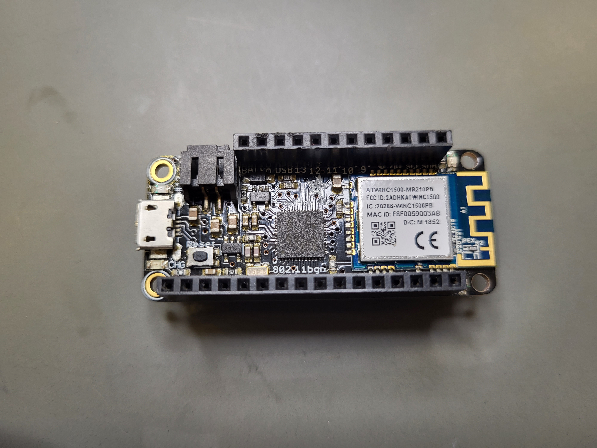
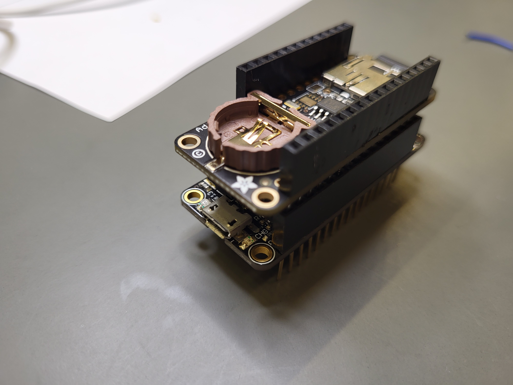
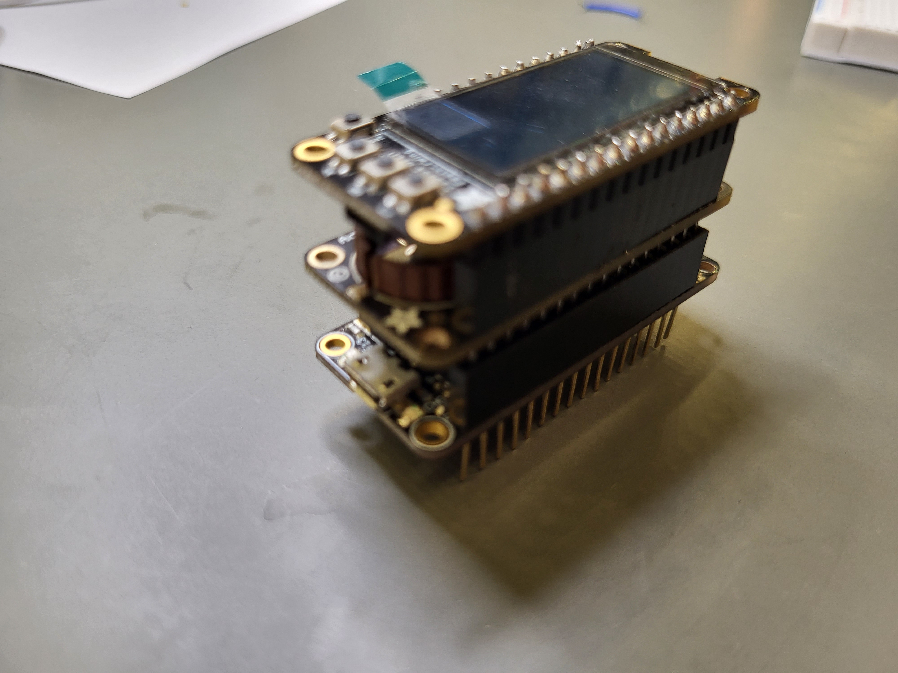
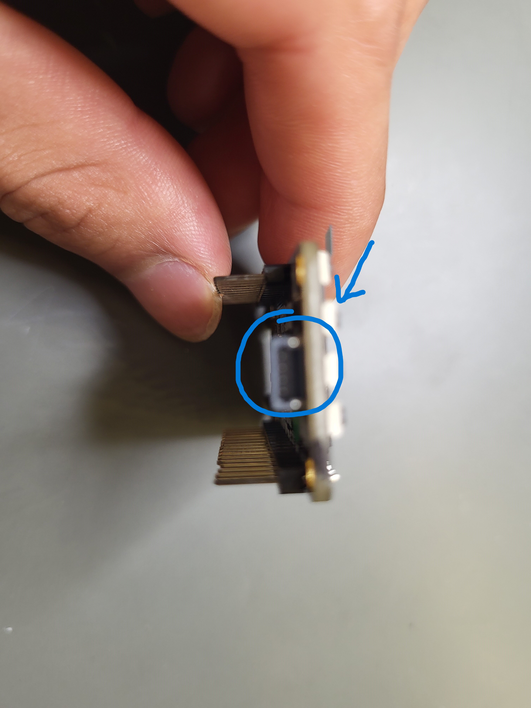
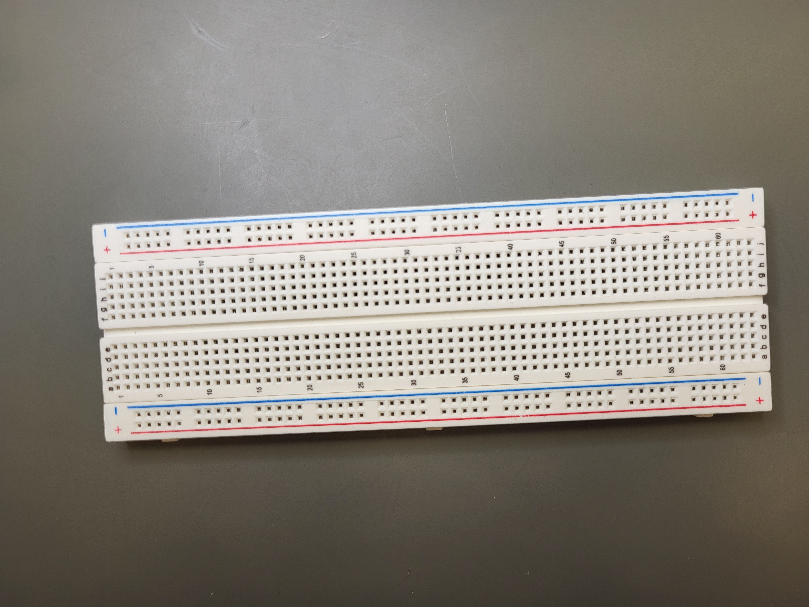
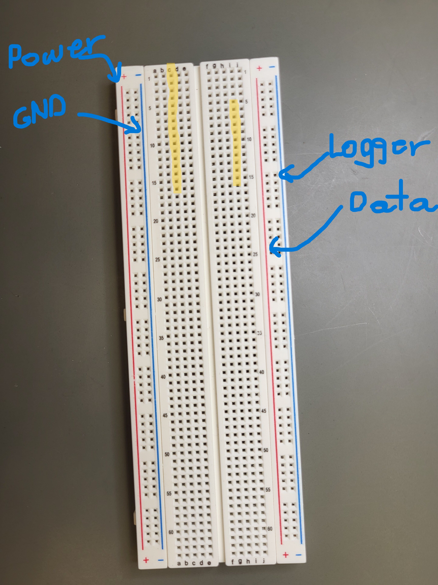

# 2. How to Assemble Air Quality Sensor Boards
This is the first part of assembling your air quality sensor and focuses on attaching the boards to 
the breadboard. Make sure that sensors and boards (with the exception of the SPS30 PM 2.5 Sensor) are soldered
to the appropriate headers. If not, refer to our [guide on the soldering air quality sensors](https://github.com/jonscrp/Instructions/blob/main/1.How%20to%20Solder%20Air%20Quality%20Sensor.md)

## Materials: 
(Refer to [Parts List](https://github.com/Community-Sensor-Lab/Air-Quality-Sensor/blob/master/README.md#Parts-List-) on GitHub)
  
  + Breadboard
  + Soldered CPU & WiFi Board
  + Soldered OLED Display Board
  + Soldered Logger & Clock Board
  + Coin Battery Cr1220
  + Micro-USB to USB Cable (or, alternatively, a battery pack)

[If you don't know how to solder check this video!]()

# Air Sensor Assembly:

Note: There are different ways that the sensors and boards can be assembled, but here is our way.

  1. Lay the CPU & WiFi Board; this will be the bottom of our board stack. This is where you can connect your micro-USB to USB cable in order to give it power for when you start using the boards.
  
  [Soldering Instructions](https://learn.adafruit.com/how-to-solder-headers/male-headers)

  

  2. Squeeze the Data Logger & Clock board onto the CPU & WiFi Board, like so. Place the Coin Battery Cr1220 onto the battery slot of the Logger & Clock Board.
  
  
  
  3. Then, place the OLED Display Board onto the Logger & Clock Board, like so.
  
  

  An alternative way to power your boards is to use a battery pack instead of a cable and connect it to the battery slot of the OLED.
  
  

  4. Lay the Breadboard down; this is where our board stack sensors will be placed.

  

  5. Place the boards down onto the breadboard, making sure that the 16-pin side span from i1-i16 and that the 12-pin side span from i4-c16.

  

  Now that you've assembled the boards, the next step is to [attach the sensors onto the breadboard!]()

  Some extra notes:
  1. The placements of the Logger & Clock Board and the CPU & WiFi Board can be interchanged.

