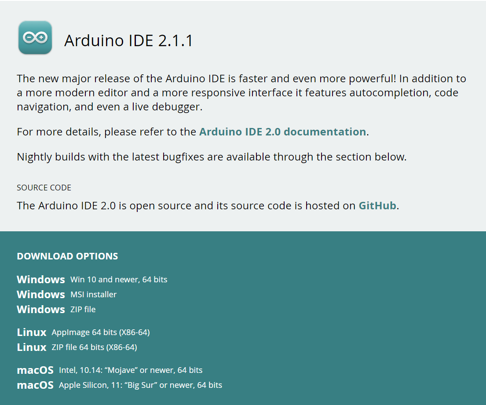
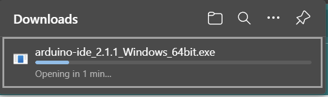
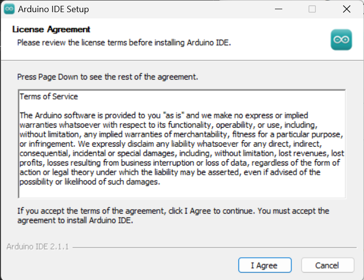
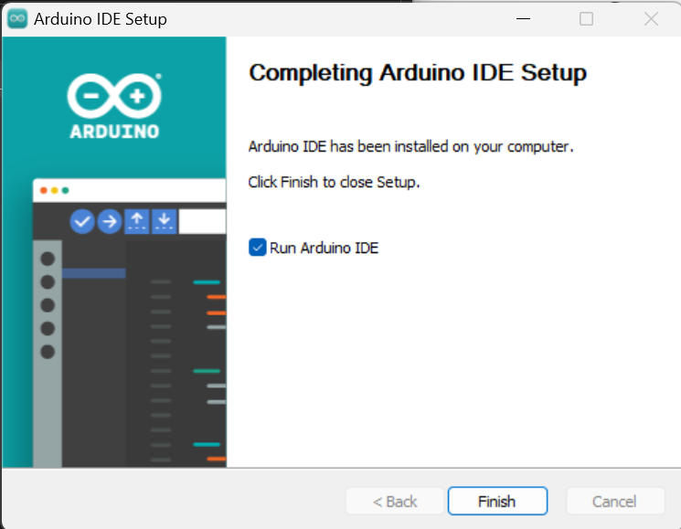
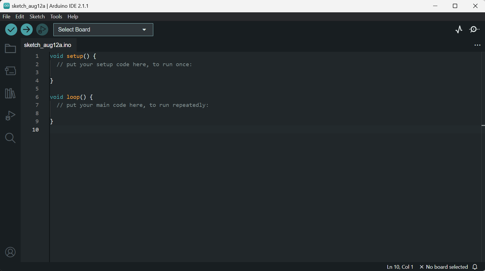
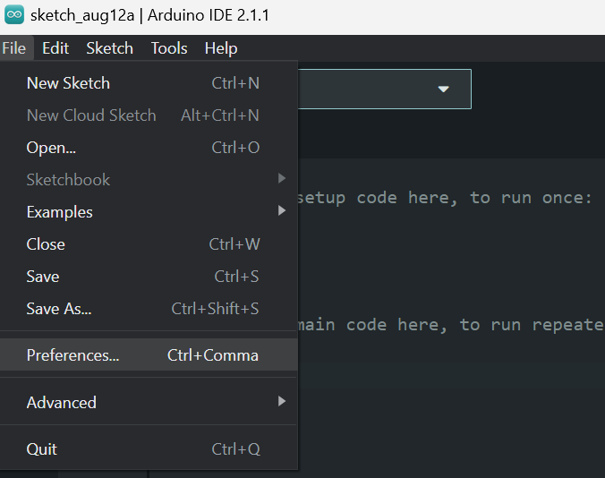
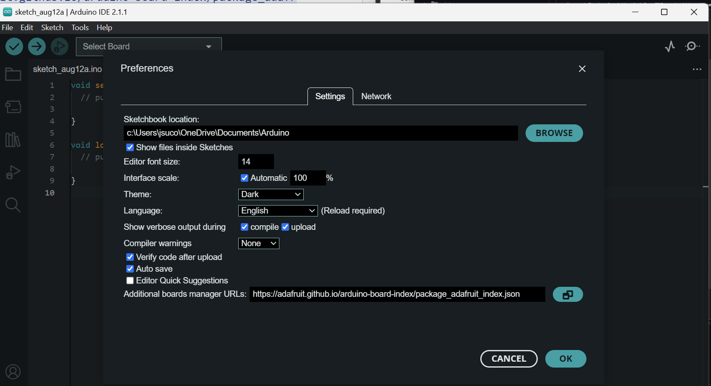
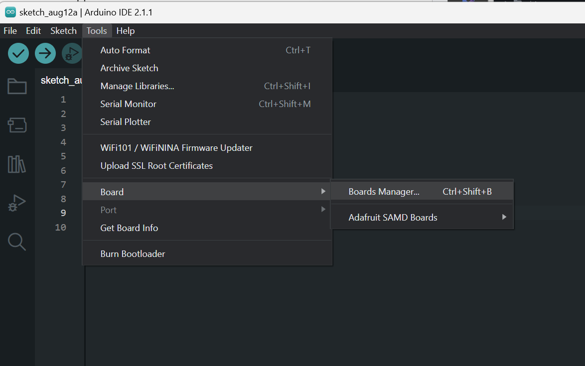
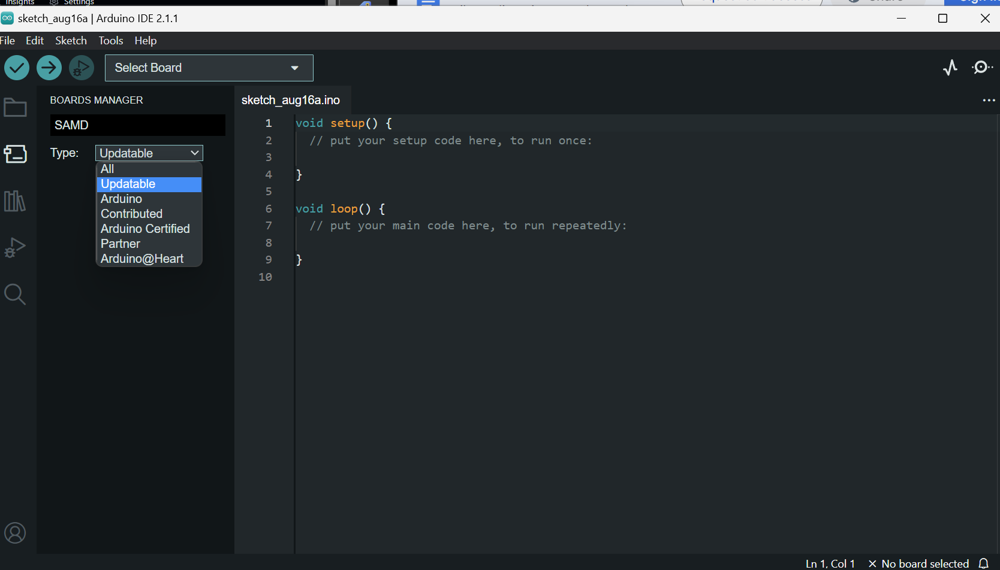
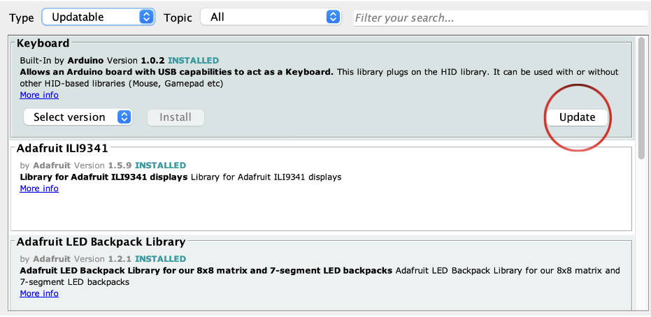

# 4 Installing Arduino

* To download the Arduino IDE go to https://www.arduino.cc/en/software.

* Select your preferred download option



In our case, we will be downloading the Windows 11 version.


> If you are using a Mac you will download it as a zip folder.
>  Open the zip folder and copy the Arduino App into your Applications Folder.
> [Help](https://docs.arduino.cc/software/ide-v1/tutorials/macOS)


 

Double-click the installer so it opens once it's done downloading






* Open Arduino IDE

***
## Arduino Environment



***
## Installing Adafruit Packages and Libraries

Before you can run any programs on the Arduino you will need to install a few packages and libraries. Without these installations, your Arduino will not be able to run any programs.

Copy this
```
 https://adafruit.github.io/arduino-board-index/package_adafruit_index.json
```
On your Arduino IDE go to 

   1. File >> Preferences
      

   3. Paste the clipped link into **Additional boards manager URLs**.
      
      
   2. Click **Ok**.

## Downloading Arduino Board Library 

  1. Go to Tools >> Board >> Board Manager 

  2. Search SAMD and download **Adafruit SAMD Boards by Adafruit**

## Downloading Other Libraries
  1. Go to Tools >> Manage Libraries
  2.  In the library manager search WiFi 101  and download **WiFi101 by Adafruit**
  3.  Repeat step 2  and download the following libraries
    * Adafruit Sleepy Dog 
    * SparkFun_SCD30_Arduino_Library 
    * Adafruit_GFX
    * Adafruit_SSD1306
    * Adafruit_BME280
    * Adafruit_SH110X
    * Sensirion I2C SEN5X

 At this point, we have to download other libraries not available in the Library Manager
  * [SP30.h by Paul van Haastrecht library](https://github.com/paulvha/sps30.git)
  * [HoneywellTruStabilitySPI.h](https://github.com/huilab/HoneywellTruStabilitySPI.git)


***

## Testing Connections

Now that you have all the libraries downloaded, you can test the connection between the Sensor and your computer.

- Head to File-example-basics-blink to pull up the code that can be used to test if the sensor is connected to your computer and have code uploaded to it.
  - Upload the code and look at the sensor when the code finishes uploading to check if the light is blinking.

* Next, go to File examples-basic-Analogreadserial which creates a serial port to test if you can send data back to the sensor.
  *  Upload the code and check the serial monitor on the top right of the Arduino application, you should see a bunch of numbers.
  * You can head to the tools-serial plotter to see a chart of the data(Optional).

* To continue on you need to go to File-example-SD-Datalogger and open the code. This code test whether the sensor is able to write the data onto the SD card in the sensor stack.
  * If the SD is not found make sure it is properly inserted
  * If the connection is not configured you must configure it.
    * To configure the SD card you need to plug the SD card into the computer to format it.
  *  When running the data logger example, note that chipSelected needs to be changed from 4 to 10 in the code.
***

## Updating Boards and Libraries

Arduino's libraries and boards are constantly updating. It is important to make sure they are up to date. You may run into issues if your libraries are not up to date.

To update the boards, go to Tools -> Board -> Boards Manager.





Click on the "Type" dropdown and select Updatable


When you hover over each library, the button "Updatable" will appear. Click Update and repeat until all the libraries have been updated.

Repeat these steps with the library manager.

Go to Tools -> Managege Libraries -> Select Type -> Updatable

Update all the libraries that require updates.


When in doubt:
- Double-click the reset button (located on the Featherwing OLED)
- Check to make sure your ports and boards are the right selected
-make sure you don’t have any conflicting libraries
- use the serial monitor to see the status of the sensor as it starts up

Useful variable to change:
- the timing of measurement (describe the equation)
WIFI FIRMWARE UPDATER, NOTE: THIS STEP DOES NOT WORK WITH THE NEW ARDUINO IDE 2.0. USE OLD IDE.

This step is to be run only when starting with a new Feather M0 Wifi board. 

- In the old Arduino IDE, go to File and select Examples, under WiFI101
  - Click on “CheckWifi101FirmwareVersion”
    - Add the following code onto the line after void setup()
      - WiFi.setPins(8, 7, 4, 2);
  - Upload the code onto the sensor
    - Check the serial monitor for the testing result
  - Click on FirmwareUpdater, also under Wifi101
    - Add the following code onto the line after void setup()
    - WiFi.setPins(8, 7, 4, 2);
    - Upload the code, there will be no feedback
- Under the tool section, click on WiFi101 / WiFiNINA Firmware/Certificates Updater
  - select the port number with the sensor 
  - then choose the latest firmware version under ‘update firmware’ and click update
  - Then click "add domain" and add the following websites
    - www.google.com
    - script.google.com
  - Check connections, update the firmware, and upload certificates.


SETTING TIME AND DATE ON ARDUINO REAL-TIME CLOCK

- Set internal clock to computer clock
  - Under examples, RTCLib Open up pcf8523 
  - Comment out lines 21, 22, 34 (type //)
  - Upload this code to the sensor
  - This code sets the internal clock of the sensor so that of the computer at the time of compiling the code. It 
   will be 10-20 secs behind.
  - DO NOT RESET/RESTART THE ARDUINO AS THAT WILL SET CLOCK BACK TO THE TIME OF COMPILATION. instead…
  - Upload the AQI code 

Visit https://github.com/Community-Sensor-Lab  ↓to code your Arduino.

