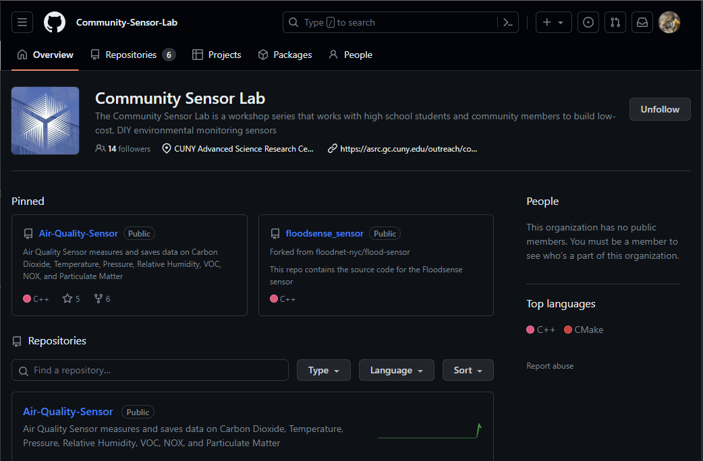
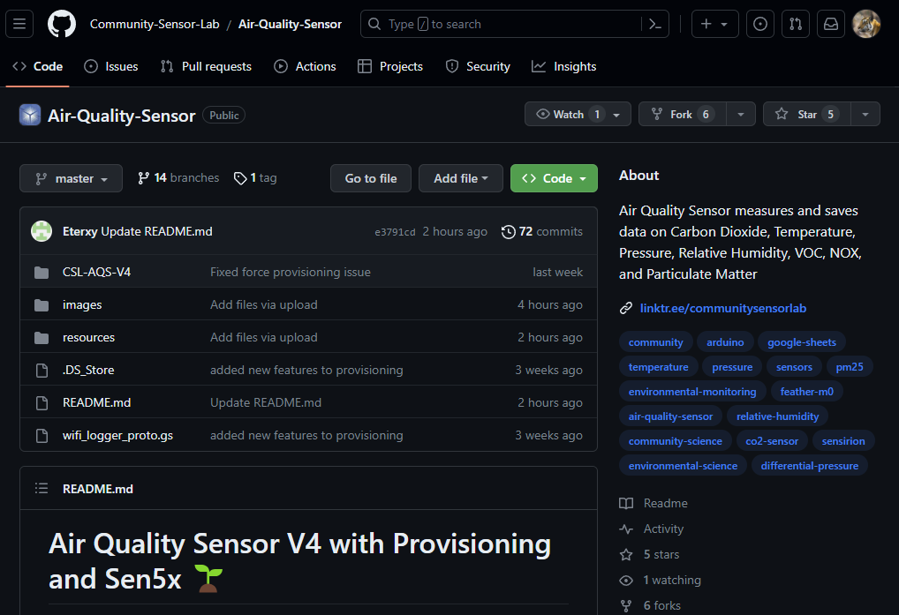
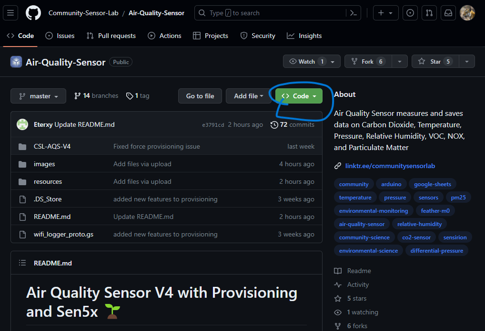
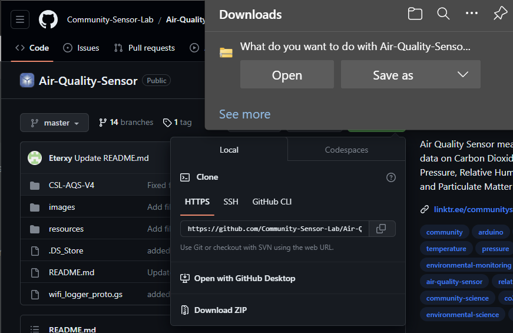
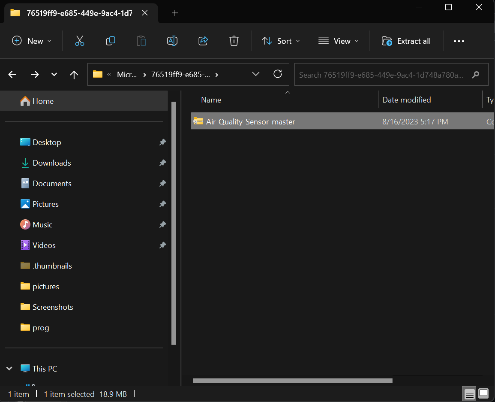
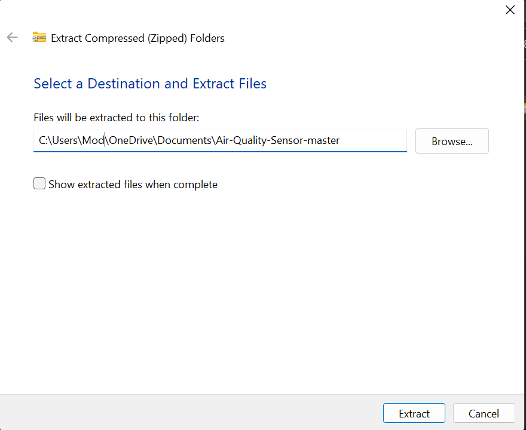
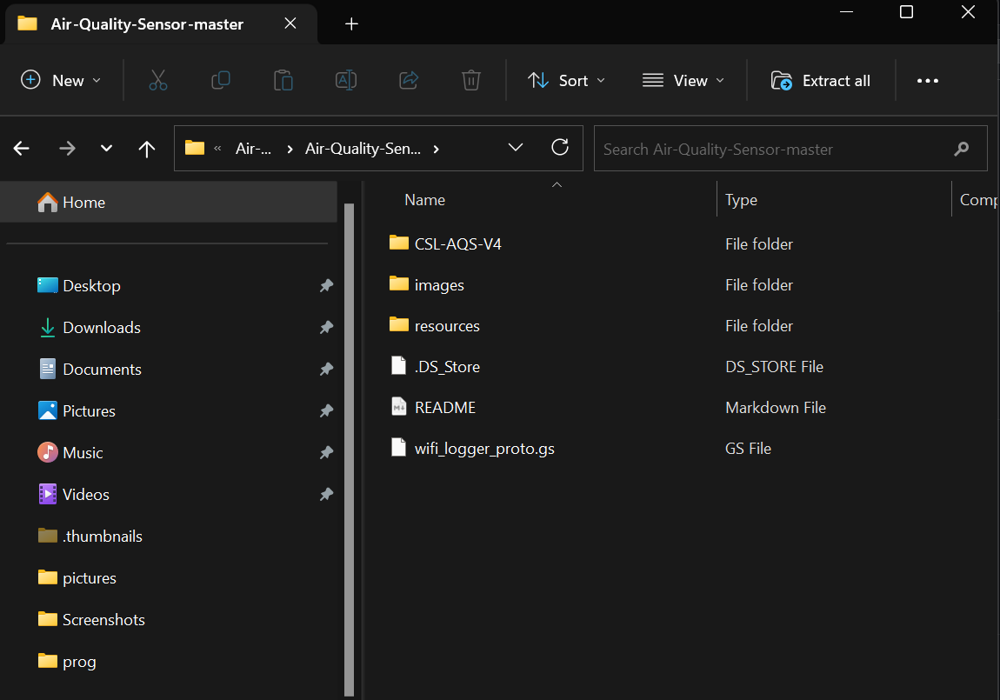

# Using Github

GitHub is an online platform that hosts code. GitHub allows people to collaborate with projects that involve code. You do not need a GitHub account to visit the site or to download code :)

You can find us, The Community Sensor Lab on Github! 
Visit: https://github.com/Community-Sensor-Lab  ↓

You can find the code for the Community Sensor Lab’s projects under Repositories.

The Air Quality Sensor repository can be seen by clicking on Air-Quality-Sensor.

***

## Air-Quality-Sensor Repository  

When you Open the Air-Quality-Sensor repository you will be on the tab <> Code.

One of the first things you will see is the repository folders.

The folder named CSL-AQS-(insert version here) has all the code you need to run your Air Quality Sensor.

The folder images contain all the images in the README.md file. The file README.md contains instructions and additional information about the AQS.

The file wifi_logger_proto.gs contains code that you could use if you want to connect the sensor to a Google Spreadsheet. 

## Download Code

The GREEN button on the right side is the button used to download the entire repository

 
Once you click on it it will give you a couple of download options.

To download the code you just need to click Download ZIP

Once you click Download ZIP, save the zip file anywhere on your computer (somewhere where you will be able to find it again)

Next, open the zip file.

Once you open the Zip File you will see a folder named Air-Quality-Sensor-master
> You can get rid of the zip file once you have accessed the Air Quality Sensor folder.

The Air-Quality-Sensor-master folder has two folders and two files inside

The only thing you will be needing is the folder CSL-AQS-(insert version)

DELETE the IMAGES folder, the README file & the WIFI_LOGGER file 

Those files will not be needed and will be available on GitHub

